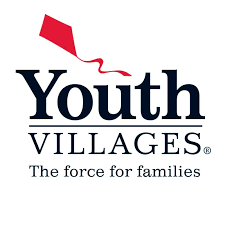

# Youth Villages

    Youth Villages provides help for children and young people across the United States who face a wide range of emotional, mental and behavioral problems. We work to find solutions using proven treatment models that strengthen the child’s family and support systems and dramatically improve their long-term success. Youth Villages directly helps tens of thousands of young people and their families every year and increases our impact through partnerships and advocacy.